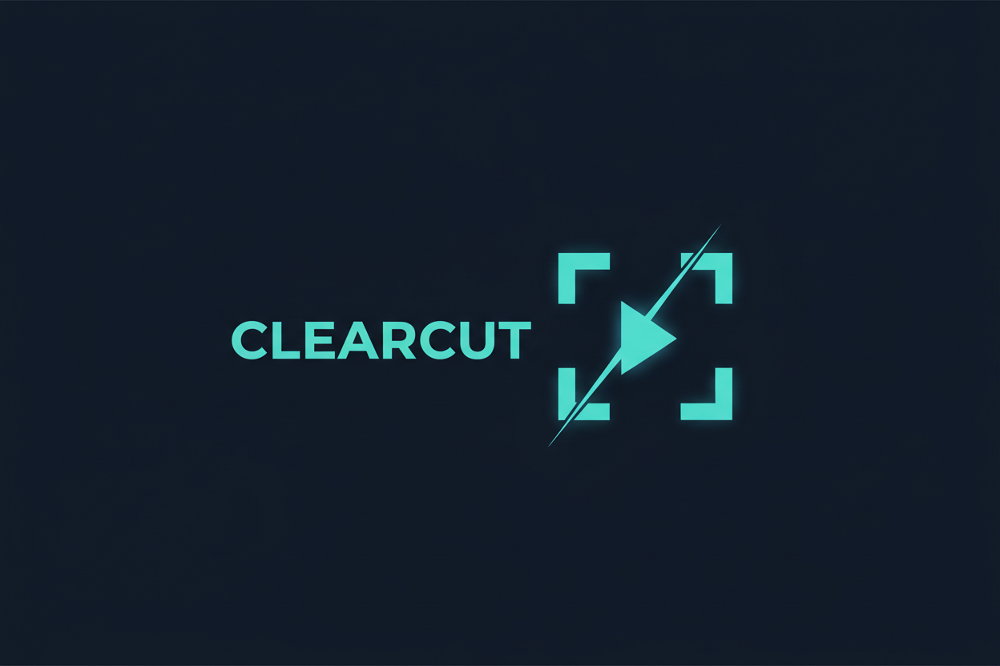

# ClearCut

> Turn a rough cut into timestamped, cited clearance evidence before legal review.

ClearCut is a clearance-preparation agent for independent filmmakers and small production teams approaching final cut or distribution. It identifies material that may need follow-up, researches selected findings, and organizes evidence for human review.

**Status:** scoped and under active development for the **Parallel track** of [Agentic Cinema: The Blockbuster Hackathon](https://agentic-cinema.devpost.com/). This repository does not yet claim a working hosted demo.

## The problem

Independent filmmakers must review visible marks, factual claims, music, and other material before distribution and errors-and-omissions review. That work is detailed, fragmented, and expensive to begin late. ClearCut helps a producer prepare a focused evidence package; it does **not** provide legal advice or automated legal clearance.

## The experience

1. Open the included original 30–45 second fictional commercial.
2. Gemini identifies three planted review candidates at exact timestamps: a fictional brand mark, a factual claim, and an original music cue.
3. Select a finding to investigate.
4. A Google Cloud Agent Builder/ADK agent converts it into a focused research task.
5. Parallel Search runs live and returns source-backed evidence.
6. Record a human decision: **dismiss, investigate, replace, or license**.
7. Export a clearance-preparation checklist.

## The wow moment

**Timestamped finding → Gemini research task → visible Parallel Search → cited evidence card → human decision**

The evidence chain is the core product interaction and the clearest proof that Gemini, Google Cloud agent orchestration, and Parallel are essential runtime components.

## Planned architecture

- C# / ASP.NET Core / Blazor for the primary product experience
- Gemini on Google Cloud for multimodal video analysis and research-task formation
- Google Cloud Agent Builder / Google ADK for deterministic agent orchestration
- Parallel Search for live external evidence retrieval
- Google Cloud Run for scale-to-zero hosting
- Google Cloud Storage and Secret Manager where required

Architecture and deployment details are documented in [docs/ARCHITECTURE.md](docs/ARCHITECTURE.md).

## Scope

The MVP is deliberately limited to one original clip, three seeded findings, one live evidence workflow, and one human-reviewed checklist. See [docs/SCOPE.md](docs/SCOPE.md).

Detailed user behavior and testable acceptance criteria are defined in [docs/PRD.md](docs/PRD.md).

The implementation-ready stack, service boundaries, file structure, data flow, AI contracts, risks, and verification gates are defined in [docs/SPEC.md](docs/SPEC.md).

The sequenced autonomous implementation and verification plan is tracked in [docs/BUILD_CHECKLIST.md](docs/BUILD_CHECKLIST.md).

## Judging evidence

We track the official Stage One gate and all four equal-weight Stage Two criteria without claiming unfinished work. See [docs/JUDGING.md](docs/JUDGING.md) and [docs/SUBMISSION_CHECKLIST.md](docs/SUBMISSION_CHECKLIST.md).

## Safety and originality

- Research assistance and evidence organization only; never legal advice
- Human approval is required for every disposition
- Demo media, marks, presenter, music, and set dressing will be newly created and fictional
- No private production footage in the hackathon demo
- Submitted implementation and visual assets will use only competition-permitted Google and partner AI tooling

## Run locally

Run instructions will be added alongside the first verified implementation. The final repository will include all source code, assets, configuration examples, and reproducible setup steps required by the rules.

## License

Licensed under the [Apache License 2.0](LICENSE).
