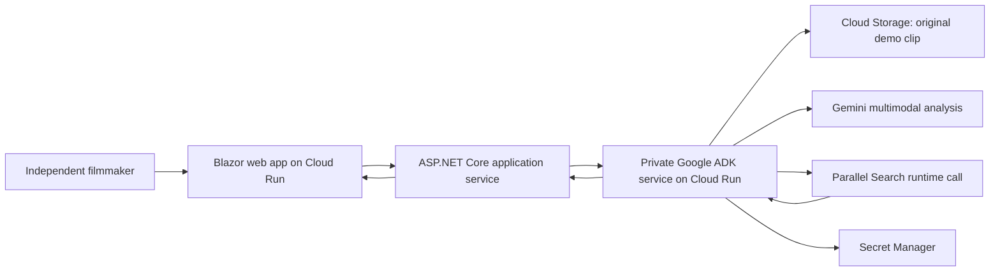
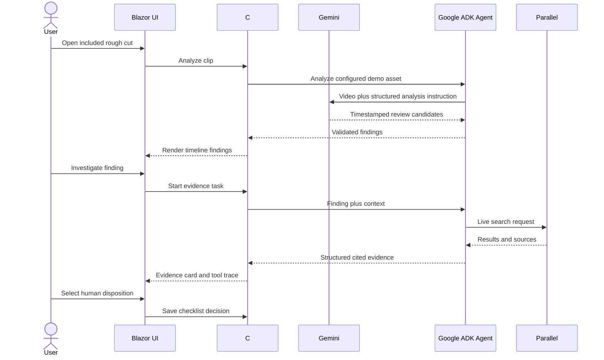

# Planned Architecture

## Design objective

Make the required runtime integrations unmistakable while keeping the 20-hour build small, deterministic, secure, and inexpensive.

## System view

## Runtime sequence

## Components

### Blazor web application

Provides the complete judge-facing experience: video playback, timestamp navigation, findings, live research status, source cards, human disposition controls, and final checklist.

### ASP.NET Core application API

Owns the typed contracts used by the UI and coordinates media access, Gemini analysis, the ADK service, validation, and export.

### Gemini on Google Cloud

Analyzes the original demonstration clip and returns structured findings with timestamp, category, observation, uncertainty, and a suggested research objective.

### Google ADK / Agent Builder

Runs a constrained evidence workflow: validate the selected finding, form the search task, invoke the permitted partner tool, normalize results, and return cited evidence. The agent must not declare legal clearance.

### Parallel Search

Performs live external research for the selected finding. Its runtime invocation and returned sources must be visible in the application and demo. Mentioning Parallel only in documentation is insufficient.

### Google Cloud Run

Hosts the web/API service and, if needed, a small Python ADK service. Minimum instances should remain zero for cost control.

### Storage and secrets

Use Cloud Storage for the Gemini-readable copy of the original demo clip and package or serve the matching playback copy from the web application. Store the Parallel credential in Secret Manager; never in source control or browser traffic.

The implementation-ready service boundaries, file tree, data contracts, failure rules, and verification gates are maintained in [SPEC.md](SPEC.md).

## Evidence contract

Each finding should contain:

- Stable finding identifier
- Start and end timestamp
- Category
- Neutral observation
- Confidence or uncertainty
- Research task
- Tool execution status
- Source title and URL
- Evidence summary
- Human disposition
- Reviewer note

## Reliability strategy

- Ship one known original clip as the golden path.
- Constrain Gemini to structured output and validate it before display.
- Limit the agent to a short deterministic sequence.
- Set request timeouts and show understandable failures.
- Preserve source URLs and identify incomplete searches.
- Capture the full successful flow in the demo video as a judging backstop.

## Cost controls

- Cloud Run minimum instances: zero
- One short demo clip
- One analysis per session unless manually rerun
- Parallel Search only after explicit user action
- Small output limits and short timeouts
- No database unless implementation proves it necessary
- Billing alerts configured in the isolated ClearCut project

## Implementation evidence still required

Before submission, replace planning language with verified package names, code paths, deployment commands, environment variables, and screenshots or logs proving runtime calls.
